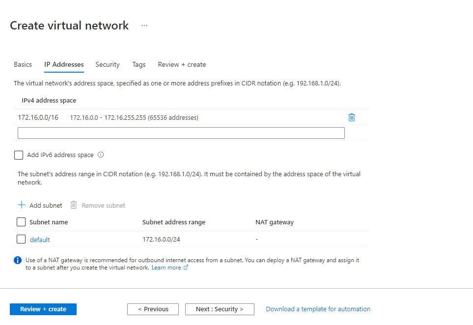

# Objectives
An Azure VM is required as an utilities host serving the following functions:
- Jump host to access the AKS environment
- Docker host for Conjur Master container
- Docker host for MySQL database container
We will also configure the Private DNS zone for name resolution here

# Provision Utilities Host
1.0. Login to your Azure Portal (https://portal.azure.com)

2.0. Setup Azure Environment

2.1. Create Azure Resource Group

Provide a name for your new resource group


Add tags as desired for your new resource group

2.2. Create Azure Virtual Network

Provide a name for your new virtual network and associate it with the resource group created in 2.1


Configure IP address space and subnet for the virtual network


Leave security as default or customize as desired.

Add tags as desired for your new resource group

3.0. Setup Azure VM

3.1. Create a virtual Machine - Basics
- Resource group: Select the resource group created in 2.1
- Image: Ubuntu Server 20.04 LTS - Gen2 (You may choose other Linux distributions as long as kubectl, Docker and MySQL are supported on it. However, note that the steps in this guide are for Ubuntu.)
- Size: Standard_D2s_v3 (This size is meant for lab or development test, if using for production, do refering to CyberArk sizing guide.)
**WARNING** The Azure VM will incur costs in your Azure subscription.
- Administrator account: You can customize to use password or SSH key authentication, choose a username, and choose to generate new or use an existing key pair as desired.


3.2. Create a virtual Machine - Disks
- Disk options: Select the disk and encryption type as desired
- Data disks: We do not need additional data disks
- Advanced: Use managed disks to enable data persistence


3.3. Create a virtual Machine - Networking
- Virtual network: Select the VNet created in 2.2
- Subnet: Select the subnet created in 2.2
- Public IP: Allow the wizard to create a new public IP, or use your existing public IP, as desired
- Public inbound ports: For lab testing purposes of this guide, we will allow access to our VM on SSH. Do follow your organization's access policy accordingly in providing access to cloud instances.


3.4. Create a virtual Machine - Create

- Leave Management and Advanced as default or customize as desired.
- Add tags as desired for your new VM.
- Review the configurations and create the Azure VM.

3.5. Verify access to the Azure VM


# Setup Docker on Utilities Host
The utilities host will be used to run the Conjur and MySQL containers.

1.0. Install docker on the utilities host
```console
sudo apt-get -y install docker.io
```

1.1. Verify that docker is running and enabled
```console
systemctl status docker
```
Sample output:
```console
● docker.service - Docker Application Container Engine
     Loaded: loaded (/lib/systemd/system/docker.service; enabled; vendor preset: enabled)
     Active: active (running) since Tue 2021-09-14 03:29:49 UTC; 18s ago
TriggeredBy: ● docker.socket
       Docs: https://docs.docker.com
   Main PID: 11694 (dockerd)
      Tasks: 10
     Memory: 44.9M
     CGroup: /system.slice/docker.service
             └─11694 /usr/bin/dockerd -H fd:// --containerd=/run/containerd/containerd.sock
```

2.0. Allow user to run docker without sudo
```console
sudo usermod -aG docker azureuser
newgrp docker
```

2.1. Verify docker installation
```console
docker --version
```
Sample output:
```console
Docker version 20.10.7, build 20.10.7-0ubuntu1~20.04.1
```

# Configure Private DNS Zone

Create a private DNS zone
e.g.
- conjur.demo


Add records for Conjur Master and MySQL to point to the IP Address of the utilities host created above
e.g.
- master.conjur.demo
- mysql.conjur.demo


Associate the private DNS with the virtual network created above

