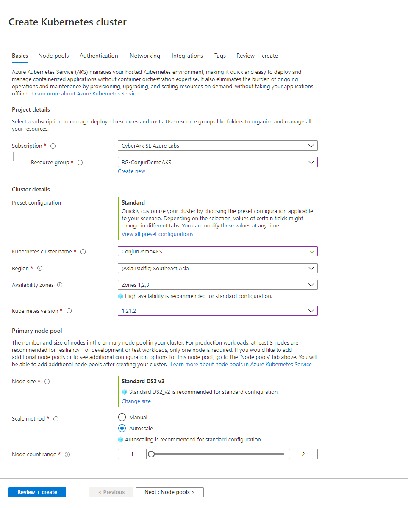
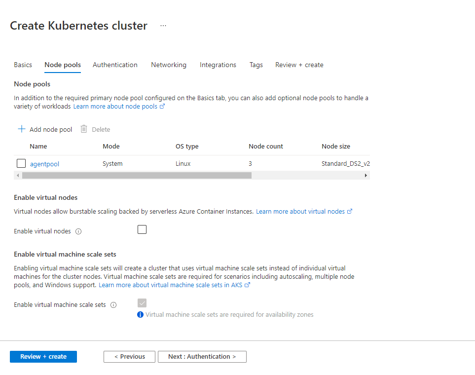
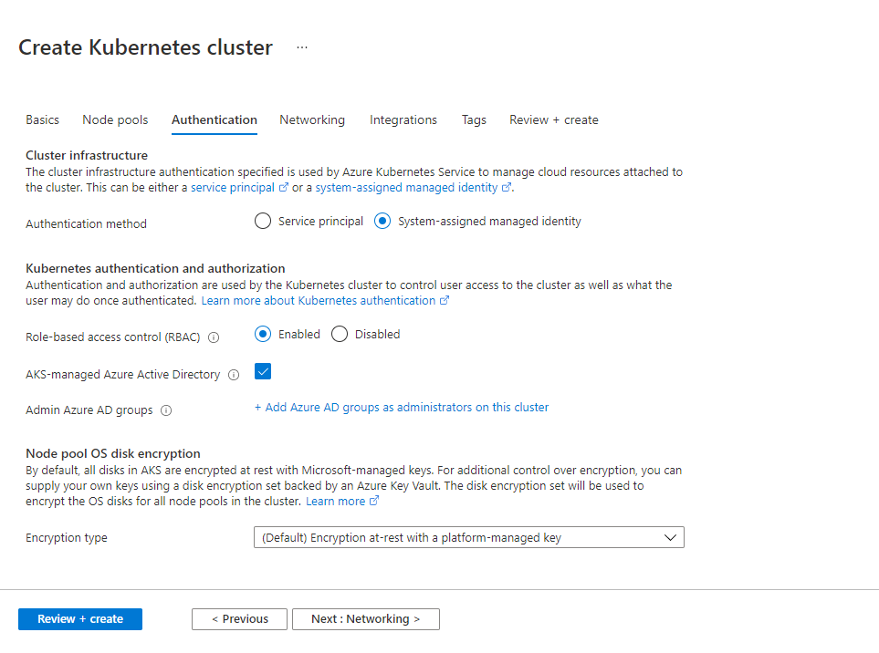
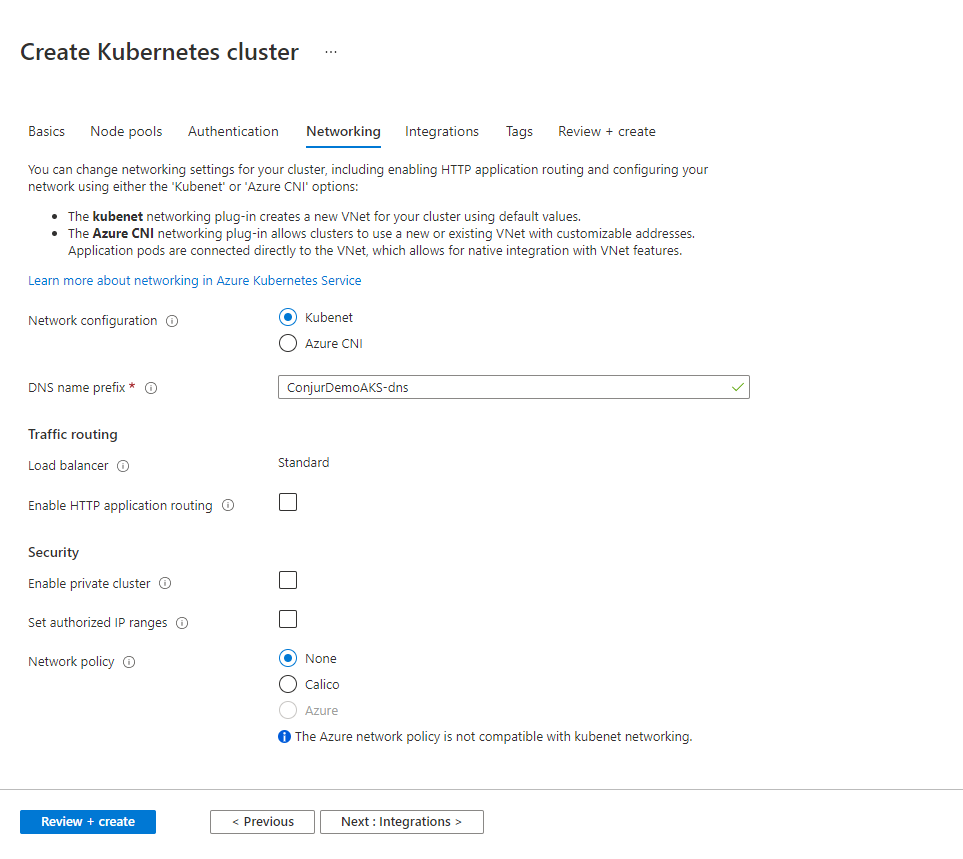
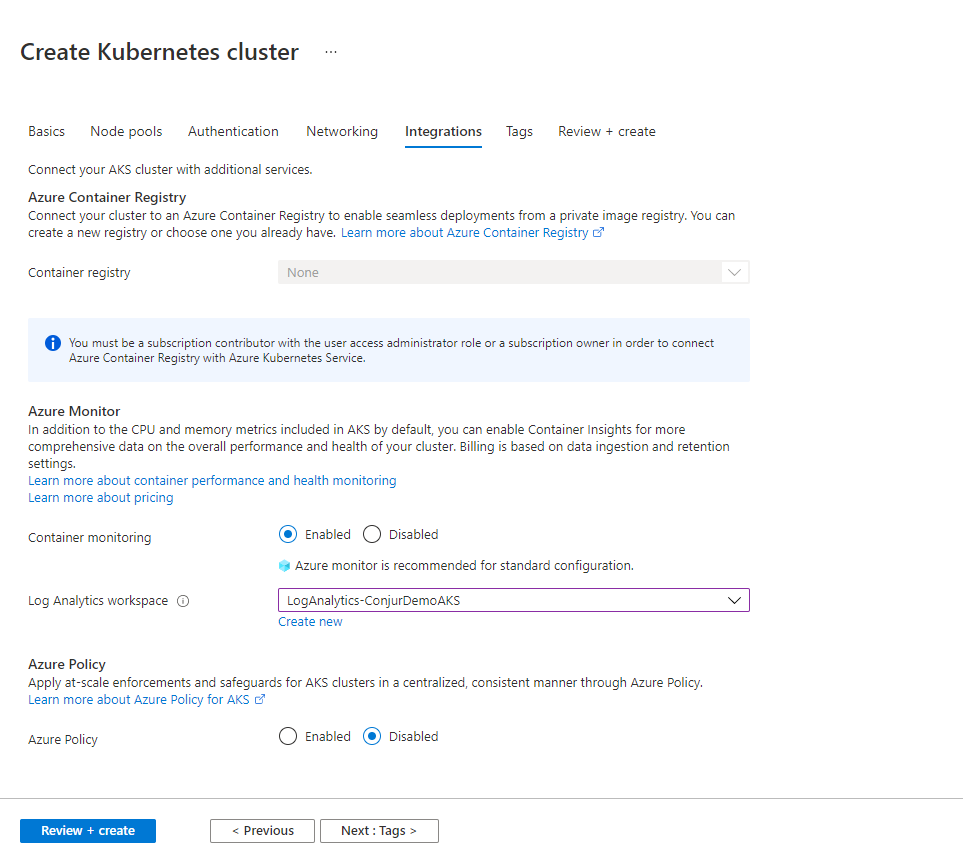
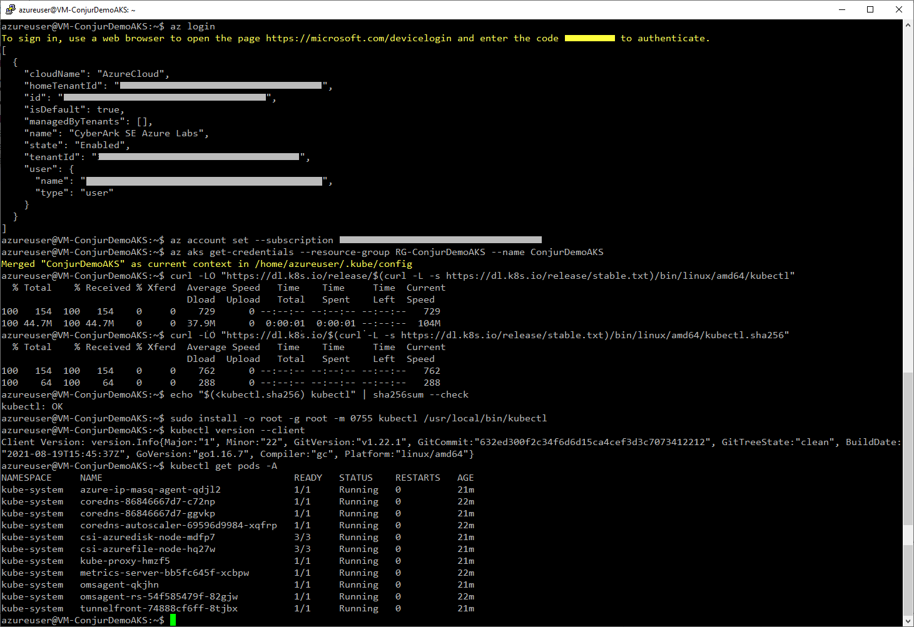
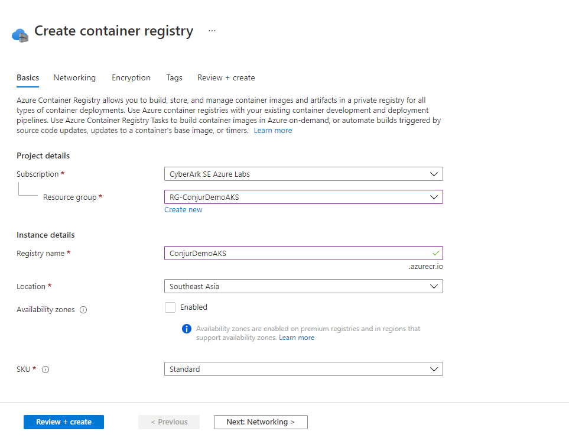

# Objectives
We will provision an AKS cluster that will run the following workloads:
- Conjur Followers
- Demo Application Containers (cityapp)
We will also provision an ACR and integrate with the AKS cluster

# Create AKS Cluster
1.0. Login to your Azure Portal (https://portal.azure.com)

2.0. Create the Kubernetes Cluster

2.1. Settings - Basics
- Select the resource group created in task 0
- Provide a name for your Kubernetes cluster
- Customize other settings as desired


2.2. Settings - Node pools
- Customize node pools settings as desired


2.3. Settings - Authentication
- Customize authentication settings as desired


2.4. Settings - Networking
- Customize networking settings as desired


2.5. Settings - Integrations
- Customize integration settings as desired


Review the settings and create the Kubernetes cluster.

# Connect to the AKS Cluster

1.0. Login to the utilities host created in task 0

2.0. Install Azure CLI

Read more about Azure CLI: https://docs.microsoft.com/en-us/cli/azure/install-azure-cli-linux
```console
curl -sL https://aka.ms/InstallAzureCLIDeb | sudo bash
```


3.0. Configure credentials to login to AKS cluster

Login using Azure CLI

Read more about Azure CLI authentication: https://docs.microsoft.com/en-us/cli/azure/authenticate-azure-cli
```console
az login
```

Retrieve the AKS credentials
```console
az account set --subscription <Subscription-ID>
az aks get-credentials --resource-group <Resource-Group-Name> --name <AKS-Cluster-Name>
```

4.0. Install kubectl

Read more about installing kubectl: https://kubernetes.io/docs/tasks/tools/install-kubectl-linux/
```console
curl -LO "https://dl.k8s.io/release/$(curl -L -s https://dl.k8s.io/release/stable.txt)/bin/linux/amd64/kubectl"
curl -LO "https://dl.k8s.io/$(curl -L -s https://dl.k8s.io/release/stable.txt)/bin/linux/amd64/kubectl.sha256"
echo "$(<kubectl.sha256) kubectl" | sha256sum --check
sudo install -o root -g root -m 0755 kubectl /usr/local/bin/kubectl
```

5.0. Verify kubectl installation

```console
kubectl version --client
```

6.0. Verify connection to AKS cluster

```console
kubectl get pods -A
```

Successful configuration of above steps should look something like this:


# Create ACR and integrate with AKS

1.0. Create the ACR

Create a container registry and provide a name for your ACR

Customize networking and encryption settings as desired, or leave them as default

From the utility host, verify that you are able to login to your ACR
```console
az login
az acr login -n <ACR-Name>
```

2.0. Integrate the ACR with AKS

From the utility host, update the ACR-AKS integration settings
For more information, read: https://docs.microsoft.com/en-us/azure/aks/cluster-container-registry-integration
```console
az login
az aks update -n <AKS-name> -g <RG-name> --attach-acr <ACR-name>
```
