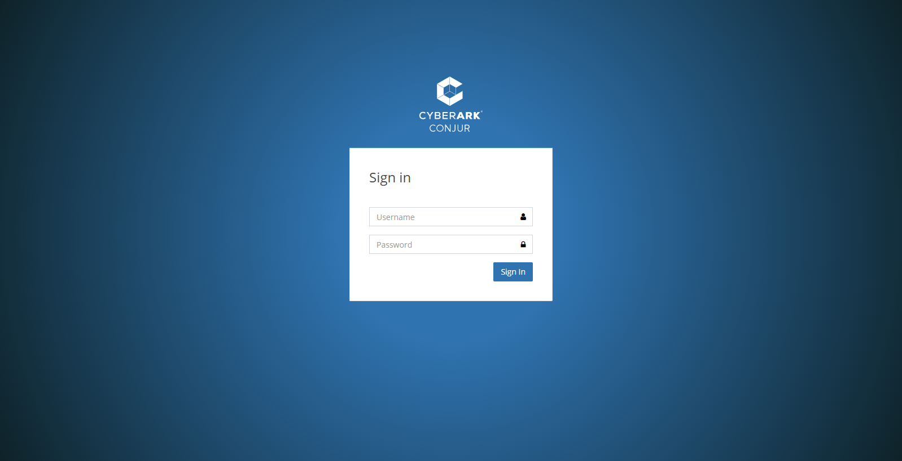
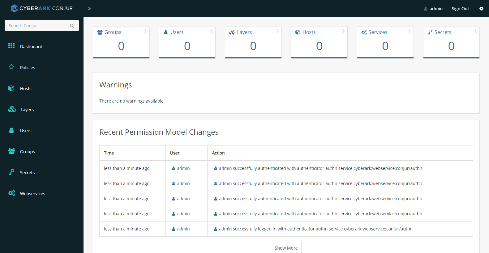

# Objectives
Setup the CyberArk Conjur Master server in utilities host

## [OPTIONAL] Creating SSL Certificates for Conjur

Conjur uses certificates for communication between the Master, Standby, and follower nodes in Conjur cluster.

To understand Conjur certificate architecture, read: https://docs.cyberark.com/Product-Doc/OnlineHelp/AAM-DAP/Latest/en/Content/Deployment/HighAvailability/certificate-architecture.htm

This optional step generates a self-signed CA, and uses the self-signed CA to sign the Conjur Master and followers certificates.
You may also proceed with the tasks using the sample certificates provided [here](https://github.com/rajnishgargcloudrepository/conjur-aks/blob/main/task04/conjur-certificates.tgz)

1.0 Generate a self-signed certificate authority
- Generate private key of the self-signed certificate authority
```console
azureuser@VM-ConjurDemoAKS:~$ openssl genrsa -out ConjurDemoCA.key 2048
Generating RSA private key, 2048 bit long modulus (2 primes)
.....................................................+++++
............................+++++
e is 65537 (0x010001)
```
- Generate certificate of the self-signed certificate authority
```console
azureuser@VM-ConjurDemoAKS:~$ openssl req -x509 -new -nodes -key ConjurDemoCA.key -days 365 -sha256 -out ConjurDemoCA.pem
You are about to be asked to enter information that will be incorporated
into your certificate request.
What you are about to enter is what is called a Distinguished Name or a DN.
There are quite a few fields but you can leave some blank
For some fields there will be a default value,
If you enter '.', the field will be left blank.
-----
Country Name (2 letter code) [AU]:SG
State or Province Name (full name) [Some-State]:Singapore
Locality Name (eg, city) []:
Organization Name (eg, company) [Internet Widgits Pty Ltd]:CyberArk Software Pte. Ltd.
Organizational Unit Name (eg, section) []:
Common Name (e.g. server FQDN or YOUR name) []:Conjur Demo Certificate Authority
Email Address []:joe.tan@cyberark.com
```
2.0 Generate certificate for Conjur Master
- Generate private key of the Conjur Master certificate
```console
openssl genrsa -out master.conjur.demo.key 2048
```
- Create certificate signing request for the Conjur Master certificate
```console
openssl req -new -key master.conjur.demo.key -subj "/CN=master.conjur.demo" -out master.conjur.demo.csr
```
- Create OpenSSL configuration file to add subject alternative name
```console
echo "subjectAltName=DNS:master.conjur.demo" > master.conjur.demo-openssl.cnf
```
- Generate certificate of the Conjur Master certificate
```console
openssl x509 -req -in master.conjur.demo.csr -CA ConjurDemoCA.pem -CAkey ConjurDemoCA.key -CAcreateserial -days 365 -sha256 -out master.conjur.demo.pem -extfile master.conjur.demo-openssl.cnf
```
3.0 Generate certificate for Conjur Followers
- Generate private key of the Conjur Followers certificate
```console
openssl genrsa -out followers.default.svc.cluster.local.key 2048
```
- Create certificate signing request for the Conjur Followers certificate
```console
openssl req -new -key followers.default.svc.cluster.local.key -subj "/CN=followers.default.svc.cluster.local" -out followers.default.svc.cluster.local.csr
```
- Create OpenSSL configuration file to add subject alternative name
```console
echo "subjectAltName=DNS:followers.default.svc.cluster.local" > followers.default.svc.cluster.local-openssl.cnf
```
- Generate certificate of the Conjur Followers certificate
```console
openssl x509 -req -in followers.default.svc.cluster.local.csr -CA ConjurDemoCA.pem -CAkey ConjurDemoCA.key -CAcreateserial -days 365 -sha256 -out followers.default.svc.cluster.local.pem -extfile followers.default.svc.cluster.local-openssl.cnf
```

## Setup Conjur Master server

### 1.0 Contact CyberArk to request for Conjur images

**WARNING:** You are legally responsible to ensure that the CyberArk software is for personal use only.
Unauthorized distribution or usage of CyberArk software is prohibited.

You will need the below Conjur images:
1. conjur-appliance_#.tar.gz
2. dap-seedfetcher_#.tar.gz
where # is the respective software version number

- This lab guide is based on Conjur version 12.2

### 1.1 Load the Conjur image into utilities host

1. Login to the utilities host setup in task 00
2. Load the Conjur and seed fetcher containers to Docker
```console
docker load -i conjur-appliance-12.2.0.tar.gz
docker load -i dap-seedfetcher-0.2.0.tar.gz
docker tag registry.tld/conjur-appliance:12.2.0 conjur-appliance:12.2.0
```
3. Verify images
```console
docker images
```
Sample output:
```console
azureuser@VM-ConjurDemoAKS:~$ docker images
REPOSITORY                         TAG       IMAGE ID       CREATED         SIZE
conjur-appliance                   12.2.0    c4c836a40c9d   3 months ago    1.33GB
registry.tld/conjur-appliance      12.2.0    c4c836a40c9d   3 months ago    1.33GB
cyberark/dap-seedfetcher           0.2.0     c259484443ba   6 months ago    30.8MB
```
### 1.2 Run the Conjur container
1. Run the Conjur container
```console
docker run --name conjur-appliance -d --restart=always --security-opt seccomp:unconfined -p "443:443" -p "636:636" -p "5432:5432" -p "1999:1999" conjur-appliance:12.2.0
```
2. Copy certificates to Conjur container
- Steps to generate the self-signed certificate chain is provided in optional section above
- For convenience, you may also use the sample certificates provided in this repoistory
```console
wget https://github.com/rajnishgargcloudrepository/conjur-aks/raw/main/task04/conjur-certificates.tgz
```
- Copy the certificates to `/tmp` of the Conjur container
```console
docker cp ./conjur-certificates.tgz conjur-appliance:/tmp/conjur-certificates.tgz
```
3.  Configure Conjur Master and import certificates
- Attach a shell from the Conjur container
```console
docker exec -it conjur-appliance /bin/sh
```
- Initialize the Conjur Master
```console
evoke configure master --accept-eula -h master.conjur.demo --master-altnames "master.conjur.demo" -p <very-secure-password> cyberark
```
Sample output:
```console
Configuration successful. Conjur master up and running.
```
- Extract and import the certificates
```console
cd /tmp
tar xvf conjur-certificates.tgz
evoke ca import --root ConjurDemoCA.pem
evoke ca import --key followers.default.svc.cluster.local.key followers.default.svc.cluster.local.pem
evoke ca import --key master.conjur.demo.key --set master.conjur.demo.pem
```
Sample output:
```console
# tar xvf conjur-certificates.tgz
ConjurDemoCA.pem
followers.default.svc.cluster.local.key
followers.default.svc.cluster.local.pem
master.conjur.demo.key
master.conjur.demo.pem
# evoke ca import --root ConjurDemoCA.pem
Stopping service 'conjur'...
ok: down: conjur: 0s, normally up
Stopping service 'nginx'...
ok: down: nginx: 1s, normally up
Stopping service 'pg'...
ok: down: pg: 0s, normally up
Stopping service 'seed'...
ok: down: seed: 1s, normally up
Clearing certificate store...
Importing root certificate...
# evoke ca import --key followers.default.svc.cluster.local.key followers.default.svc.cluster.local.pem
Imported certificate for followers.default.svc.cluster.local
# evoke ca import --key master.conjur.demo.key --set master.conjur.demo.pem
Imported certificate for master.conjur.demo
Setting as the local certificate...
Starting service 'conjur'...
ok: run: conjur: (pid 1598) 0s
Starting service 'nginx'...
ok: run: nginx: (pid 1643) 0s
Service 'pg' is already running.
Starting service 'seed'...
ok: run: seed: (pid 1656) 4s
```
### 1.3 Setup Conjur CLI

The Conjur CLI implements the Conjur REST API, providing an alternate interface for managing Conjur resources, including roles, privileges, policy, and secrets.

We will use the Conjur CLI version 7.0.1. For more information, read: https://github.com/cyberark/conjur-api-python3/releases

- Download and extract the Conjur CLI package
```console
wget https://github.com/cyberark/conjur-api-python3/releases/download/v7.0.1/conjur-cli-rhel-8.tar.gz
tar xvf conjur-cli-rhel-8.tar.gz
```
- Move the Conjur CLI package to `/usr/bin` and change permission to allow execution
```console
mv conjur /usr/bin
chmod +x /usr/bin/conjur
```
- Initialize Conjur CLI connection to Conjur Master
```console
conjur init -u https://master.conjur.demo
```
Sample output:
```console
azureuser@VM-ConjurDemoAKS:~$ conjur init -u https://master.conjur.demo

The Conjur server's certificate SHA-1 fingerprint is:
34:27:C3:A9:BE:D7:73:8F:F2:15:A6:02:83:E2:D4:5C:00:A2:6D:1F

To verify this certificate, we recommend running the following command on the Conjur server:
openssl x509 -fingerprint -noout -in ~conjur/etc/ssl/conjur.pem

Trust this certificate? yes/no (Default: no): yes
Certificate written to /home/azureuser/conjur-server.pem

Configuration written to /home/azureuser/.conjurrc

Successfully initialized the Conjur CLI
To start using the Conjur CLI, log in to the Conjur server by running `conjur login`
```
### 1.4 Access to Conjur web UI
1. Add an inbound rule in the Azure Network Security Group to allow inbound HTTPS connection
2. Access the Conjur web UI using the utilities host public IP address
3. Login as admin using the password configured in step 3 of section 1.2
- Conjur Login UI

- Conjur Master UI

